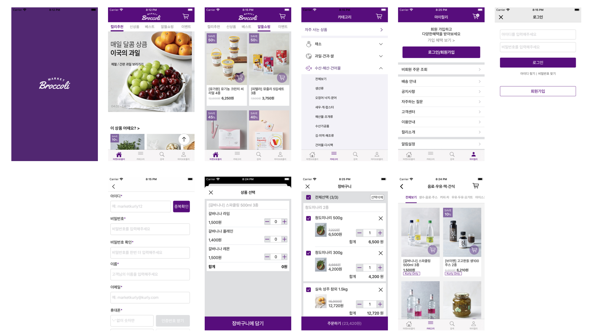

# MarketKurly Clone

> 패스트캠퍼스 iOS School 에서 진행한 Backend School과의 협업 프로젝트  

## 설명

- 기간: 2020.03.20 ~ 2020.04 29
- 사용 기술:
  - 언어: Swift
  - 프레임워크: UIKit
  - 라이브러리: Alamofire, Kingfisher, SnapKit, SwiftLint, Then
  - 협업 툴: Slack, Notion, github Projects
- 인원: 4명
- 기여도: 40%
- 역할:
  - iOS 팀장
  - 메인페이지, 상품 상세페이지
  - 반복적으로 사용되는 기능 개발 (`ObserverManager`, `RequestManager`, `KurlyNotification`, `Extensions`등)
  - 프로젝트 기획, [일정 관리, 업무 분배](https://github.com/iOS-WPS-Team3/iOS-team3/projects), [Git 강의](https://www.notion.so/marketbroccoli/Git-Guide-4f89e0af659d4083bbefc43009a41016), Trouble Shooting
  - 팀간의 원활한 의사소통을 위해 Daily Scrum을 주도적 진행
- 성과:
  - Alamofire, Kingfisher, SnapKit, Then등의 라이브러리를 적용하여 생산성 향상
  - [SwiftLint 및 자체 코딩 규칙](https://www.notion.so/marketbroccoli/5afaab16f70d44de830a5d762a12db18)을 적용하여 가독성 향상
  - 팀장으로서 기획/관리를 진행하며 스스로 부족한점을 파악, 개선
  - 팀원들의 일정과 업무강도를 조율해가며 다른팀 보다 더 나은 팀워크를 발휘해 다툼없이 프로젝트를 완성했다. 
  - Daily Scrum, Trouble Shooting을 통해 한사람도 이탈 없이 프로젝트를 완성
 
 
## 결과

 
 
 

> 클릭시 유튜브로 이동합니다.

